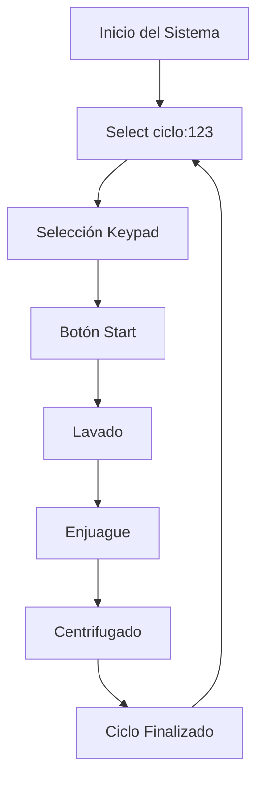

# 🧺 Proyecto: Lavadora Inteligente con STM32L053R8

---

## 🧠 Descripción General

Este proyecto implementa una **lavadora automatizada** basada en un microcontrolador **STM32L053R8**, controlada mediante **interrupciones y temporizadores (TIM)**.  
El sistema combina control de motor, display multiplexado, interfaz LCD, teclado matricial, buzzer, sensores y comunicación serial.  
Además, la **carcasa y estructura fueron modeladas en Blender y fabricadas mediante impresión 3D**.

El código está completamente desarrollado en **C bajo entorno bare-metal**, haciendo uso directo de los registros del microcontrolador (sin HAL).

---

## ⚙️ Características Principales

- 🧩 **Microcontrolador:** STM32L053R8 (ARM Cortex-M0+)  
- ⏱️ **Timers:**  
  - **TIM2:** PWM del motor (20 kHz)  
  - **TIM21:** Interrupción de 1 ms → LCD, keypad, display y buzzer  
  - **TIM22:** Interrupción de 1 s → conteo regresivo y control de etapas  
- ⚡ **Interrupciones EXTI:** botones, switch de tapa y cancelación  
- 📟 **LCD 16x2:** interfaz de texto para usuario (modo 4 bits)  
- 🔢 **Display 7 segmentos:** contador regresivo multiplexado  
- 🎛️ **Keypad 1x3:** selección de ciclo (3, 6 y 9 minutos)  
- 🌀 **Motor con driver L298N:** control de sentido y velocidad mediante PWM  
- 🔈 **Buzzer:** alertas no bloqueantes (inicio, error, fin de ciclo)  
- 💡 **LEDs:** indican la etapa del proceso (lavado, enjuague, centrifugado)  
- 🧱 **Estructura física:** modelada en **Blender** y fabricada en **impresora 3D**

---

## 🔌 Conexiones Principales

| Componente | Pines STM32 | Descripción |
|-------------|-------------|-------------|
| **LCD 16x2** | D4–D7 = PA8–PA11 E = PA5 RS = PA4 | Modo 4 bits, controlado por FSM no bloqueante |
| **Display 7 segmentos (4 dígitos)** | Seg a–g = PB0–PB6 Dig D1–D4 = PC5, PC6, PC8, PC9 | Multiplexado dinámicamente con TIM21 |
| **Keypad (1x3)** | Fila = PC4 Columnas = PB7–PB9 | Selección de ciclo (3, 6, 9 min) |
| **Motor (L298N)** | IN1 = PC2 IN2 = PC3 ENA = PA0 (TIM2_CH1 PWM) | Control de dirección y velocidad |
| **Buzzer** | PA6 | PWM de alerta |
| **LEDs** | Lavado = PA12 Enjuague = PA15 Centrifugado = PB10 | Indicadores de etapa |
| **Botones EXTI** | Start = PC1 (EXTI1) Cancelar = PB11 (EXTI11) | Control de inicio y cancelación de ciclo |
| **Switch de tapa** | PB12 (EXTI12) | Seguridad: detiene motor si la tapa está abierta |
| **USART2** | TX = PA2 RX = PA3 | Comunicación serial (115200 bps) |

---

## 🧭 Lógica de Funcionamiento

1. El sistema inicia mostrando **"Select ciclo:123"** en el LCD.  
2. El usuario elige un ciclo (3, 6 o 9 minutos) mediante el keypad.  
3. Al presionar **Start**, el ciclo inicia si la tapa está cerrada.  
4. El sistema ejecuta tres etapas:
   - **Lavado**
   - **Enjuague**
   - **Centrifugado**
5. Cada etapa dura un tiempo proporcional al ciclo elegido.  
6. El **display 7 segmentos** muestra el tiempo restante en formato `MM:SS`.  
7. Al finalizar, suena el **buzzer** y el LCD muestra vuelve a solicitar ciclo.
---

## 🔄 Control del Motor

| Etapa | Dirección | PWM (TIM2->CCR1) | Descripción |
|--------|------------|------------------|--------------|
| Lavado | Horario | 40 | Movimiento constante |
| Enjuague | Alterna cada 500 ms | 20 → 35 | Cambio de sentido suave |
| Centrifugado | Horario | 70 | Alta velocidad final |

El control de sentido se realiza invirtiendo **IN1/IN2 (PC2–PC3)**.  
El PWM a 20 kHz evita ruidos audibles y permite una velocidad estable.

---

## 🕹️ Interfaz del Usuario

### **Keypad (1x3)**
Permite elegir el ciclo:
- **C1 → 3 min (rápido)**  
- **C2 → 6 min (normal)**  
- **C3 → 9 min (pesado)**  

Posee *debounce por software* en `tecla_activa()`.

### **Botones EXTI**
- **Start (PC1):** inicia el ciclo seleccionado.  
- **Cancelar (PB11):** detiene y resetea el sistema.

### **Switch de Tapa (PB12)**
- Si se abre durante un ciclo:  
  - Se apaga el motor y LEDs.  
  - Muestra “Tapa abierta”.  
  - Emite un sonido corto.  
- Al cerrarse: reanuda automáticamente el ciclo.

---

## 🧱 Diseño Físico

El prototipo de la lavadora fue:
- **Modelado en Blender** para definir proporciones, ensamblaje y estética.  
- **Fabricado con impresión 3D (PLA)** para la carcasa y tapa superior.  
- El montaje integra el **STM32 Nucleo**, el **driver L298N**, el **LCD 16x2**, el **display 7 segmentos**, y los **LEDs de estado**.

El diseño prioriza **modularidad**: cada subsistema (display, motor, LCD, teclado) está aislado por headers tipo “header files” y organizado en funciones específicas.

---

## 🕓 Timers e Interrupciones

| Timer / Interrupción | Función | Frecuencia / Periodo | Descripción |
|-----------------------|----------|----------------------|--------------|
| **TIM2** | PWM motor | 20 kHz | Controla velocidad de giro |
| **TIM21** | Interrupción de 1 ms | 1 kHz | LCD, display, keypad y buzzer |
| **TIM22** | Interrupción de 1 s | 1 Hz | Control de etapas y conteo regresivo |
| **EXTI1 (PC1)** | Botón Start | evento | Inicia el ciclo |
| **EXTI11 (PB11)** | Botón Cancelar | evento | Cancela el ciclo |
| **EXTI12 (PB12)** | Switch tapa | evento | Pausa/reanuda por seguridad |

---

## 📟 Interfaz LCD

El LCD 16x2 funciona en **modo 4 bits**, controlado por una **máquina de estados (FSM)** que actualiza la pantalla cada 1 ms mediante `LCD_Service_1ms()`.

Flujo:
1. Inicialización paso a paso (comandos 0x03, 0x02, 0x28, 0x0C, 0x06, 0x01).  
2. Escritura de texto carácter por carácter sin bloqueo.  
3. Cambio de texto mediante `LCD_PrintNew()`.  

El LCD se usa para mostrar el estado actual del sistema: selección, etapas y avisos.

---

## 🔢 Display 7 Segmentos Multiplexado

El display muestra el tiempo restante (`MM:SS`).  
El control se realiza cada **2 ms** en `print_display()`, activando un dígito a la vez con su respectivo valor BCD.

---

## 🧠 Flujo General de Software

---

## 🎥 Video de Demostración
Demostración Física:

Explicación código:

